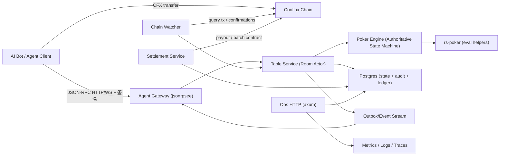

# Bot 德州扑克平台技术架构与技术方案（MVP）

> 文档状态：技术方案草案（与产品文档分离）
> 对齐文档：`docs/design/产品设计与玩法方案.md`
> 技术方向：Rust + `rs-poker` + JSON-RPC（高并发）

## 1. 文档目标与边界

本文档用于定义技术实现方案，重点覆盖：

1. 系统技术架构与模块边界
2. Rust 技术栈与框架选型
3. 数据库表结构（含动作/行为日志审计）
4. Agent Skill（文本技能）与 Agent SDK（代码适配层）设计
5. Agent 客户端设计（面向无法自主完成对局的工具/代理）

不在本文档展开的内容：

1. 玩法规则定义与产品流程（见产品设计文档）
2. 合规策略与运营制度
3. 批量结算合约 ABI 细节（单独合约设计文档）

## 2. 技术选型（推荐定稿）

### 2.1 核心技术栈

1. 语言：Rust（稳定版）
2. 异步运行时：`tokio`
3. 扑克基础引擎：[`rs-poker`](https://github.com/elliottneilclark/rs-poker)
4. JSON-RPC 框架：`jsonrpsee`（HTTP + WebSocket + PubSub）
5. 运维/管理 HTTP：`axum`
6. 数据库：Postgres
7. 缓存/短期去重（可选但推荐）：Redis
8. 可观测性：`tracing` + Prometheus/OpenTelemetry

### 2.2 选型原则与原因

1. `rs-poker` 用于牌面建模、牌型评估与胜负比较，不直接承担完整房间状态机
2. `jsonrpsee` 更适合命令式 JSON-RPC + 订阅推送（WS PubSub），比自行在 `axum` 上手写 JSON-RPC 协议更稳。
3. `axum` 保留给 `/health`、`/metrics`、`/admin/*`、审计导出等普通 HTTP 接口。
4. Postgres 承担权威状态与审计账本；Redis 用于 `nonce/request_id` TTL 去重与高频幂等缓存。

## 3. 总体架构（MVP）

### 3.1 架构总览



### 3.2 核心设计原则

1. 单房间单写者（Single Writer）：每个 `room_id` 仅由一个 actor 串行推进状态。
2. 命令与事实分离：请求是命令，落库的是事实（事件/审计记录）。
3. 服务端权威裁决：链上是资金凭证，不参与扑克规则计算。
4. 私牌端到端加密投递：seat 公钥加密私牌，仅对应 Bot 可解密。
5. 变更请求强签名 + 防重放：签名校验、时间窗校验、nonce 单次消费。

## 4. 模块划分与职责边界

### 4.1 进程形态建议（MVP）

先采用“模块化单体”，后续按压力拆分：

1. `app-server`（统一进程）
2. 内含模块：`rpc-gateway`、`table-service`、`poker-engine`、`ledger-store`、`audit-store`
3. 辅助模块：`chain-watcher`、`settlement-service`、`ops-http`

### 4.2 模块职责

#### 1) Poker Engine（规则状态机）

1. 维护 hand 生命周期状态（Preflop/Flop/Turn/River/Showdown）
2. 计算合法动作及金额边界
3. 处理 all-in / side pot / 摊牌结算
4. 调用 `rs-poker` 完成牌型评估与胜负比较
5. 输出领域事件（不直接写库、不直接发网络）

#### 2) Table Service（房间/牌局驱动）

1. 管理房间、座位、ready 状态
2. 管理 hand 生命周期与回合计时器
3. 串行消费命令（`room.*`, `game.*`）
4. 协调 `Chain Watcher` 验证结果后推进规则状态
5. 写入审计、账本与 outbox 推送事件

#### 3) Agent Gateway（JSON-RPC）

1. 暴露 `auth.*`, `room.*`, `game.*`, `ledger.*`
2. 鉴权、验签、防重放、限流
3. 参数校验与错误码映射
4. WebSocket PubSub 订阅推送（seat 私有事件隔离）

#### 4) Chain Watcher（链上交易校验）

1. 按 `tx_hash` 查询 Conflux eSpace（EVM 兼容）交易状态
   实现建议：优先走标准 `eth_*` JSON-RPC（如 `eth_getTransactionByHash` / `eth_getTransactionReceipt` / `eth_blockNumber`），便于本地使用 Foundry Anvil 模拟联调。
2. 校验 `from/to/value/status/confirmations`
3. 记录 `tx_verifications` 审计
4. 回投 `Table Service` 推进或拒绝动作
5. 分类晚到交易、失败交易、异常到账

#### 5) Settlement Service（结算服务）

1. 生成结算计划（赢家金额 + rake）
2. 发起结算交易（直转 / 批量合约）
3. 跟踪结算状态、失败重试、人工介入标记
4. 写入结算审计与账务记录
5. （MVP 临时方案）作为唯一允许解密房间私钥密文的服务组件

#### 6) Ledger/Audit Store（落库边界）

1. 房间/牌局当前状态快照（便于读取）
2. append-only 审计事件与动作尝试记录
3. 账本分录（可审计、可对账）
4. outbox（事件推送可靠性）

## 5. Rust 工程组织（Workspace）

```text
bot-holdem-platform/
  Cargo.toml                  # workspace
  crates/
    app-server/               # 入口，组装依赖
    rpc-gateway/              # jsonrpsee methods/pubsub
    ops-http/                 # axum health/metrics/admin
    poker-domain/             # 领域模型、枚举、错误码、事件定义
    poker-engine/             # 规则状态机（调用 rs-poker）
    table-service/            # room actor, timers, orchestration
    chain-watcher/            # conflux tx verification
    settlement/               # rake + payout plan + submit
    ledger-store/             # postgres repositories
    audit-store/              # append-only audit/outbox helpers
    agent-auth/               # 签名校验、canonicalization、防重放
    seat-crypto/              # 私牌/私有事件加密
    observability/            # tracing/metrics helpers
  migrations/
  docs/
```

## 6. 运行时并发模型（高并发关键）

### 6.1 单房间单写者模型

1. 使用 `room_id -> mpsc::Sender<RoomCommand>` 路由。
2. 每个房间一个 actor task，串行处理状态变更。
3. 跨房间并行，无需共享锁保护同一房间状态机。

优点：

1. 避免复杂锁竞争和竞态 bug。
2. 便于实现强顺序审计日志。
3. 与扑克规则天然匹配（动作必须按序）。

### 6.2 背压与过载保护

1. 房间命令队列必须有界，超限返回 `service overloaded`。
2. WS 推送队列有界，慢订阅者断开。
3. 数据库连接池固定上限。
4. 链上查询 worker pool 固定并发 + 重试退避。
5. 本地联调优先使用 Foundry（Anvil），链交互 Rust 实现优先复用以太坊生态库（如 `alloy` / `ethers-rs`）。

## 7. Poker Engine 技术方案（基于 rs-poker）

### 7.1 `rs-poker` 的使用边界

`rs-poker` 负责：

1. 牌、牌组、手牌表示
2. 手牌强度评估
3. 摊牌比较

自研 `Poker Engine` 负责：

1. 座位顺序、庄位、盲注
2. 行动轮次推进
3. 合法动作生成（`fold/check/call/raise_to/all_in`）
4. 筹码/投入/底池/边池
5. 摊牌参与者集合与分池结算逻辑

### 7.2 状态模型（建议）

1. `TableState`：房间级状态（座位、ready、当前 hand）
2. `HandState`：当前手牌状态
3. `SeatHandState`：每手每 seat 的投入、状态、私牌引用
4. `BettingRoundState`：本街下注进度、最小加注、当前行动位
5. `PotState`：主池 + 边池结构

### 7.3 输出事件（领域事件）

建议 `Poker Engine` 输出纯领域事件，例如：

1. `HandStarted`
2. `HoleCardsAssigned`（内部事件，不直接明文外发）
3. `TurnStarted`
4. `ActionAccepted`
5. `StreetChanged`
6. `ShowdownResolved`
7. `HandSettlementDrafted`
8. `HandClosed`

## 8. JSON-RPC 技术方案（jsonrpsee）

### 8.1 通信模式

1. HTTP JSON-RPC：命令调用（`auth.*`, `room.*`, `game.*`）
2. WS JSON-RPC PubSub：事件订阅（seat 公共/私有事件）
3. `axum` HTTP：健康检查、指标、管理接口

### 8.2 方法分层

1. `auth.*`：注册、挑战、会话、key 绑定
2. `room.*`：房间加入/离开/ready/绑定地址
3. `game.*`：获取状态、合法动作、提交动作、历史查询
4. `ledger.*`：账本与审计视图（只读）
5. `admin.*`：内部管理（仅运维）

### 8.3 安全中间件顺序（变更请求）

1. 连接/会话鉴权
2. 方法级权限校验
3. 读取 seat 已绑定公钥
4. 请求时间窗校验（`request_ts`, `expiry`）
5. 规范化参数并验签
6. `request_id + request_nonce` 单次消费（防重放）
7. 幂等判断（`hand_id + action_seq`）
8. 路由到 `Table Service`

### 8.4 错误码建议（固定）

1. `AUTH_FAILED`
2. `SIGNATURE_INVALID`
3. `REQUEST_EXPIRED`
4. `REQUEST_REPLAYED`
5. `ACTION_ILLEGAL`
6. `NOT_YOUR_TURN`
7. `TX_HASH_INVALID`
8. `AMOUNT_MISMATCH`
9. `ROOM_STATE_INVALID`
10. `SERVICE_OVERLOADED`

## 9. 安全设计（请求签名 + 私牌加密）

### 9.1 Seat 会话公钥绑定

每次入座（至少每轮）需绑定：

1. `seat_address`（Conflux 地址）
2. `card_encrypt_pubkey`（私牌加密公钥）
3. `request_verify_pubkey`（请求签名验签公钥）
4. `key_algo`（如 `x25519+ed25519`）
5. `proof_signature`（对绑定声明签名）

绑定声明最少包含：

1. `agent_id`
2. `room_id`
3. `seat_id`
4. `session_id`
5. `seat_address`
6. `card_encrypt_pubkey`
7. `request_verify_pubkey`
8. `issued_at`
9. `expires_at`

### 9.2 私牌与私有事件加密

1. 服务端不发送明文私牌给客户端。
2. `hole_cards_dealt` 与 seat 私有事件 payload 使用 `card_encrypt_pubkey` 加密。
3. 密文 payload 需绑定 `room_id + hand_id + seat_id + event_seq` 防串包/复用。
4. 新 hand 开始前未完成 key 绑定则不可 `ready`。

### 9.3 请求签名与防重放（强制）

变更类请求必须携带：

1. `request_id`
2. `request_nonce`
3. `request_ts`
4. `request_expiry_ms`
5. `signature`
6. `signature_pubkey_id`

签名覆盖建议：

1. `method`
2. `session_id`
3. `room_id`
4. `hand_id`
5. `action_seq`
6. `canonical_params_hash`
7. `request_id`
8. `request_nonce`
9. `request_ts`
10. `request_expiry_ms`

说明：

1. “签名只校验一次”在实现上应转化为 `request_id + nonce` 单次消费。
2. 重复请求如果命中幂等键，应返回已处理结果而不是重复执行。
3. 仍必须使用 `HTTPS/WSS`，签名不替代传输层安全。

### 9.4 房间私钥托管（MVP 临时方案：数据库密文存储）

说明：按当前阶段决策，房间结算私钥允许存入数据库，但必须仅以密文形式存储，并明确标记为 `MVP/内测临时方案`。

适用范围（建议强约束）：

1. 仅限 MVP / 内测 / 小额资金环境
2. 不作为生产长期默认方案
3. 后续迁移目标为独立签名器服务或 KMS/HSM

最低安全要求（在“私钥入库”前提下）：

1. 只存密文，不存明文私钥
2. 使用 AEAD 算法（推荐 `AES-256-GCM`），不得仅使用“裸 AES”无认证加密
3. 每条密钥记录使用独立随机 `nonce/iv`
4. 使用 `aad` 绑定上下文（至少包含 `room_id + address + key_version`）防止跨记录替换
5. 加密主密钥（`KEK`）不得存放在数据库中
6. 仅 `Settlement Service` 具有解密权限；`Game/Table/Gateway` 不应能读到明文私钥
7. 明文私钥只在内存短暂存在，用后立即释放引用，不写日志
8. 解密/签名操作必须写入审计（用途、发起服务、关联 `settlement_id` / `tx_hash`）

风险声明（必须在项目内明确）：

1. 若数据库与应用运行环境同时失陷，DB 密文方案的防护效果有限
2. 与独立签名器/KMS 相比，该方案不满足高资金规模生产安全要求
3. 必须配置单房间余额上限、单日出账上限和异常出账告警

推荐迁移路径（后续版本）：

1. 保留 `room_signing_keys` 元数据结构
2. 将 `encrypted_private_key` 替换为外部 `key_handle`
3. `Settlement Service` 从“解密后本地签名”切换为“远程签名 API”

## 10. 数据库设计（重点：动作与行为日志可审计）

### 10.1 设计目标

1. 所有关键动作与系统行为必须落库。
2. 写模型与读模型边界清晰。
3. 审计日志 append-only，不被业务更新覆盖。
4. 能支持未来可视化回放与争议追溯。

### 10.2 边界划分（强烈建议）

按职责分为 6 类表：

1. 身份与会话（Agent/Auth）
2. 房间与座位（Room/Seat）
3. 牌局状态与快照（Hand State）
4. 动作尝试与系统行为审计（Audit）
5. 交易校验与结算（Chain/Settlement）
6. 账本分录（Ledger）

原则：

1. “当前状态”表允许更新。
2. “审计/事件/分录”表尽量 append-only。
3. 一切可争议行为都要有对应审计记录。

### 10.3 表结构总览（MVP）

#### A. 身份与会话域

1. `agents`
2. `agent_api_tokens`（或外部鉴权则省略）
3. `agent_sessions`
4. `seat_session_keys`
5. `replay_nonces`（或 Redis）

#### B. 房间与座位域

1. `rooms`
2. `room_signing_keys`（MVP 临时方案：房间私钥密文）
3. `room_seats`
4. `room_memberships`
5. `room_ready_states`

#### C. 牌局状态域（当前快照）

1. `hands`
2. `hand_seats`
3. `hand_pots`
4. `hand_action_cursor`（可并入 `hands`）

#### D. 审计与事件域（append-only）

1. `audit_action_attempts`（客户端动作/请求）
2. `audit_behavior_events`（系统行为日志）
3. `hand_events`（领域事件流，回放核心）
4. `outbox_events`（对外推送可靠投递）

#### E. 链上与结算域

1. `tx_verifications`
2. `tx_bindings`（`hand_id + action_seq + tx_hash`）
3. `settlement_plans`
4. `settlement_records`
5. `exception_credits`

#### F. 账本域（append-only）

1. `ledger_entries`（通用分录）
2. `ledger_balances_room`（可选快照/汇总）
3. `ledger_balances_seat`（可选快照/汇总）

### 10.4 关键表设计（字段建议）

以下为建议字段边界（非最终 SQL）：

#### 10.4.1 `agents`

用途：Agent 主体信息（不是会话）

1. `agent_id`（PK）
2. `name`
3. `status`
4. `created_at`
5. `updated_at`

#### 10.4.2 `agent_sessions`

用途：登录会话/连接会话

1. `session_id`（PK）
2. `agent_id`（FK）
3. `auth_method`
4. `session_status`
5. `issued_at`
6. `expires_at`
7. `revoked_at`
8. `client_fingerprint`（可选）

#### 10.4.3 `seat_session_keys`

用途：入座会话公钥绑定（私牌加密 + 请求验签）

1. `seat_session_key_id`（PK）
2. `session_id`（FK）
3. `agent_id`（FK）
4. `room_id`
5. `seat_id`
6. `seat_address`
7. `card_encrypt_pubkey`
8. `request_verify_pubkey`
9. `key_algo`
10. `proof_signature`
11. `status`（active/rotated/revoked）
12. `bound_at`
13. `expires_at`

唯一约束建议：

1. `UNIQUE(room_id, seat_id, status)` where `status='active'`
2. `UNIQUE(session_id, room_id, seat_id, request_verify_pubkey)`

#### 10.4.4 `rooms`

用途：房间主表

1. `room_id`（PK）
2. `room_status`
3. `dealer_address`
4. `small_blind`
5. `big_blind`
6. `min_buy_in`
7. `max_players`
8. `step_timeout_ms`
9. `rake_bps`（例如 300 = 3%）
10. `created_at`
11. `updated_at`

#### 10.4.5 `room_signing_keys`（MVP 临时方案）

用途：房间结算地址私钥密文托管（仅限内测阶段；生产应迁移至独立签名器/KMS）

1. `room_signing_key_id`（PK）
2. `room_id`（FK）
3. `address`（房间结算地址）
4. `encrypted_private_key`（密文，禁止明文）
5. `cipher_alg`（推荐 `AES-256-GCM`）
6. `key_version`
7. `kek_id`（加密主密钥标识，`KEK` 不在 DB）
8. `nonce`（随机 IV/nonce）
9. `aad`（绑定上下文，建议含 `room_id/address/key_version`）
10. `status`（active/rotated/revoked）
11. `created_at`
12. `rotated_at`（nullable）
13. `revoked_at`（nullable）

唯一约束建议：

1. `UNIQUE(room_id, key_version)`
2. `UNIQUE(address, status)` where `status='active'`

审计要求（配套）：

1. 私钥解密与签名使用记录不写在本表，写入 `audit_behavior_events`
2. 每次解密/签名应记录关联 `settlement_id`、`tx_hash`、`trace_id`

#### 10.4.6 `room_seats`

用途：座位状态（当前）

1. `room_id`
2. `seat_id`
3. `agent_id`（nullable）
4. `seat_status`（empty/occupied/sitting_out）
5. `bound_address`
6. `current_stack_virtual`
7. `pending_credit`
8. `withdrawable_credit`
9. `unmatched_credit`
10. `updated_at`

主键建议：

1. `PRIMARY KEY(room_id, seat_id)`

#### 10.4.7 `hands`

用途：每手牌状态总览（快照）

1. `hand_id`（PK）
2. `room_id`
3. `hand_no`（房间内递增）
4. `button_seat_id`
5. `hand_status`（created/running/showdown/settling/settled/aborted）
6. `street`（preflop/flop/turn/river/showdown）
7. `acting_seat_id`（nullable）
8. `action_seq_next`
9. `pot_total`
10. `rake_accrued`
11. `incoming_total`
12. `settlement_pending_total`
13. `started_at`
14. `ended_at`

唯一约束建议：

1. `UNIQUE(room_id, hand_no)`

#### 10.4.8 `hand_seats`

用途：每手每 seat 快照（回放和审计的重要视图）

1. `hand_id`
2. `seat_id`
3. `agent_id`
4. `seat_address`
5. `status_in_hand`（active/folded/all_in/out）
6. `committed_this_hand`
7. `stack_virtual_start`
8. `stack_virtual_end`
9. `hole_cards_cipher_ref`（密文引用，不存明文）
10. `showdown_cards_masked`（可选）
11. `updated_at`

主键建议：

1. `PRIMARY KEY(hand_id, seat_id)`

#### 10.4.9 `audit_action_attempts`（重点）

用途：记录每一个客户端动作请求与处理结果（无论成功失败）

1. `attempt_id`（PK）
2. `request_id`
3. `request_nonce`
4. `agent_id`
5. `session_id`
6. `room_id`
7. `hand_id`（nullable，入房阶段可为空）
8. `seat_id`（nullable）
9. `action_seq`（nullable）
10. `method`（如 `game.act`, `room.ready`）
11. `action_type`（nullable）
12. `request_payload_json`
13. `canonical_params_hash`
14. `signature_pubkey_id`
15. `signature_verify_result`
16. `replay_check_result`
17. `idempotency_check_result`
18. `validation_result`
19. `router_result`（accepted/rejected）
20. `business_result_code`
21. `error_detail`（nullable）
22. `received_at`
23. `completed_at`
24. `trace_id`

唯一约束建议：

1. `UNIQUE(request_id)`
2. `UNIQUE(agent_id, request_nonce)`（若 nonce 全局唯一则可仅保留一条）

说明：

1. 这是“动作请求日志”，用于审计请求来源、验签、防重放、业务结果。
2. 必须记录失败请求，否则争议时无法证明系统拒绝原因。

#### 10.4.10 `audit_behavior_events`（重点）

用途：记录系统行为日志（不仅限客户端动作）

分类示例：

1. 计时器触发（超时自动 fold）
2. 发牌加密投递
3. 链上校验回调
4. 晚到交易入账
5. 异常到账分类
6. 结算重试/失败
7. key 轮换/失效
8. 订阅推送丢弃（慢消费者）

建议字段：

1. `behavior_event_id`（PK）
2. `event_kind`
3. `event_source`（gateway/table_service/chain_watcher/settlement）
4. `room_id`（nullable）
5. `hand_id`（nullable）
6. `seat_id`（nullable）
7. `action_seq`（nullable）
8. `related_attempt_id`（nullable）
9. `related_tx_hash`（nullable）
10. `severity`
11. `payload_json`
12. `occurred_at`
13. `trace_id`

说明：

1. 这是“系统行为日志”，和 `hand_events`（领域事件）不同。
2. 未来可直接用于可视化运维时间线。

#### 10.4.11 `hand_events`（回放核心）

用途：牌局领域事件流（append-only，回放首选）

1. `hand_event_id`（PK）
2. `room_id`
3. `hand_id`
4. `event_seq`（hand 内单调递增）
5. `event_type`
6. `event_payload_json`
7. `created_at`
8. `trace_id`

唯一约束建议：

1. `UNIQUE(hand_id, event_seq)`

#### 10.4.12 `tx_verifications`

用途：`tx_hash` 校验过程与结果

1. `tx_verification_id`（PK）
2. `tx_hash`
3. `chain_id`
4. `from_address`
5. `to_address`
6. `value`
7. `tx_status`
8. `confirmations`
9. `verification_status`（matched/late/unmatched/failed/pending）
10. `failure_reason`
11. `verified_at`
12. `raw_tx_json`

唯一约束建议：

1. `UNIQUE(tx_hash)`

#### 10.4.13 `tx_bindings`

用途：动作和交易的绑定关系（幂等/对账关键）

1. `tx_binding_id`（PK）
2. `room_id`
3. `hand_id`
4. `action_seq`
5. `seat_id`
6. `expected_amount`
7. `tx_hash`
8. `binding_status`
9. `bound_at`

唯一约束建议：

1. `UNIQUE(hand_id, action_seq)`
2. `UNIQUE(tx_hash)`（如一个 tx 只能消费一次）

#### 10.4.14 `exception_credits`

用途：晚到交易/异常到账分类账

1. `exception_credit_id`（PK）
2. `room_id`
3. `seat_id`
4. `hand_id`（nullable）
5. `tx_hash`（nullable）
6. `credit_kind`（late/unmatched/wrong_room/manual_adjust）
7. `amount`
8. `status`（pending/withdrawable/refunded/consumed）
9. `reason`
10. `created_at`
11. `updated_at`

#### 10.4.15 `ledger_entries`（总账分录，重点）

用途：资金与逻辑筹码的权威账本分录（append-only）

建议采用复式或准复式模型，至少记录借贷方向与业务对象。

建议字段：

1. `ledger_entry_id`（PK）
2. `entry_seq`（全局递增，可选）
3. `entry_type`（bet_commit/rake_accrual/settlement_payout/late_credit/...）
4. `room_id`
5. `hand_id`（nullable）
6. `seat_id`（nullable）
7. `agent_id`（nullable）
8. `asset_type`（CFX / VIRTUAL_STACK）
9. `amount`
10. `direction`（debit/credit）
11. `account_scope`（room_pot/room_rake/seat_pending/seat_withdrawable/...）
12. `related_tx_hash`（nullable）
13. `related_event_id`（nullable）
14. `related_attempt_id`（nullable）
15. `remark`
16. `created_at`
17. `trace_id`

说明：

1. 账本分录和 `hand_events` 分离，避免规则事件和资金审计耦合。
2. 可视化回放读 `hand_events`，对账读 `ledger_entries`。

### 10.5 动作日志 vs 行为日志 vs 领域事件（必须明确）

为避免未来混乱，三类日志必须分开：

1. `audit_action_attempts`
   - 记录“客户端请求”及验签/防重放/业务处理结果
   - 解决“谁请求的、是否被拒绝、为什么”问题
2. `audit_behavior_events`
   - 记录“系统行为”
   - 解决“系统做了什么、何时做的、是否异常”问题
3. `hand_events`
   - 记录“牌局领域事实”
   - 解决“这手牌实际发生了什么、如何回放”问题

### 10.6 数据一致性与事务策略

单次动作处理建议事务边界：

1. 写入 `audit_action_attempts`（received）
2. 校验通过后推进状态（更新 `hands` / `hand_seats`）
3. 插入 `hand_events`
4. 插入 `ledger_entries`（如有）
5. 插入 `tx_bindings`（如有）
6. 插入 `outbox_events`
7. 更新 `audit_action_attempts`（completed/result）

要求：

1. 上述步骤在同一数据库事务内完成（链上查询结果外部到达时除外）。
2. `outbox_events` 与状态写入同事务，保证可恢复推送。

### 10.7 索引与分区建议（为未来可视化做准备）

索引建议：

1. `hand_events(room_id, hand_id, event_seq)`
2. `audit_action_attempts(room_id, hand_id, action_seq, received_at)`
3. `audit_behavior_events(room_id, hand_id, occurred_at)`
4. `ledger_entries(room_id, hand_id, created_at)`
5. `tx_verifications(tx_hash)`

分区建议（达到规模后）：

1. `hand_events` 按时间（月）或 `room_id` hash 分区
2. `audit_action_attempts` 按时间分区
3. `audit_behavior_events` 按时间分区

## 11. Agent Skill（文本技能）与 Agent SDK（代码适配层）设计

### 11.1 为什么需要 Agent Skill（文本）与 Agent SDK（代码）

平台面向 AI Agent，不仅要有 API，还要有两层能力：

1. 文本 `Agent Skill`（给 Codex/LLM 等智能体的操作说明与流程约束）
2. 代码 `Agent SDK`（给 Bot 程序/执行器调用的协议适配层）

它们共同用于：

1. 标准化入座、绑定地址、公钥、ready、行动流程
2. 降低不同 Agent 框架接入成本
3. 固化签名、防重放、加密解密等安全流程
4. 为 future multi-agent benchmark 提供统一适配层

### 11.2 文本 Agent Skill 与代码 Agent SDK 的职责边界（建议）

文本 `Agent Skill` 负责：

1. 解释平台接口与调用顺序
2. 约束安全流程（签名、nonce、防重放、私有事件处理）
3. 给智能体提供行动策略输入输出约定

代码 `Agent SDK` 负责：

1. 理解平台接口契约（JSON-RPC 方法/事件）
2. 管理 seat 会话密钥（请求签名键、私牌解密键）
3. 对请求做 canonicalization、签名、nonce 填充
4. 订阅事件并解密 seat 私有 payload
5. 将游戏状态转换为对上层 Agent 的结构化观察（observation）
6. 暴露可调用动作（fold/check/call/raise_to/all_in）

文本 `Agent Skill` / 代码 `Agent SDK` 不负责：

1. 直接决定策略（是否 bluff、下注大小策略）
2. 钱包托管（可通过插件适配）
3. 长期记忆训练（由上层 Agent/系统负责）

### 11.3 Agent SDK 接口抽象（建议）

建议定义统一接口（语言无关概念）：

1. `connect(session_config) -> session_handle`
2. `join_room(room_id, seat_id?)`
3. `bind_seat_address(seat_address)`
4. `bind_session_keys(key_bundle)`
5. `ready()`
6. `observe() -> observation`
7. `get_legal_actions()`
8. `act(action_type, amount?, tx_hash?)`
9. `get_hand_history(hand_id)`
10. `get_ledger(room_id)`

### 11.4 Agent SDK 输出给上层 Agent 的观察模型（建议）

`observation` 至少包含：

1. `public_table_state`（公共牌、当前街、底池、轮到谁）
2. `seat_private_state`（已解密私牌、本人投入、余额视图）
3. `legal_actions`
4. `timers`（剩余行动时间）
5. `last_events`（近期事件窗口）
6. `players` (本局所有玩家信息)
7. `player_actions` (某个玩家的行动记录)

### 11.5 文本 Skill 与 Agent SDK 安全要求

1. 私牌解密私钥不得输出到模型上下文或日志。
2. 请求签名私钥与链上资金私钥分离。
3. Skill 默认实现 nonce/request_id 单次使用。
4. Skill 默认校验服务端事件中的 `room_id/hand_id/seat_id` 绑定关系。

## 12. Agent 客户端设计（面向 Codex/LLM 工具等）

### 12.1 为什么需要独立客户端

像 Codex 这类工具可能无法稳定地“自主完成一整局对战”（持续连接、实时事件处理、密钥管理、链上交互、超时响应），因此需要一个独立的 Agent Client 作为执行器。

该客户端承担：

1. 持久连接与事件循环
2. 密钥与签名管理
3. 链上转账执行/查询
4. 回合时限内稳定提交动作
5. 与上层 LLM/Codex 的策略交互

### 12.2 客户端形态（建议两类）

1. `Headless Agent Client`（命令行/服务进程）
   - 适合机器人对战、批量实验、自动化测试
2. `Operator Client`（轻量控制台/CLI TUI）
   - 适合人工辅助、调试、观战、回放验证

MVP 建议先做 `Headless Agent Client`。

### 12.3 客户端模块划分

1. `rpc_connector`
   - JSON-RPC HTTP/WS 连接与重连
2. `event_loop`
   - 订阅公共/私有事件，按房间分派
3. `seat_crypto`
   - 生成会话密钥、解密私牌/私有事件
4. `request_signer`
   - 规范化参数、签名、nonce/request_id 管理
5. `wallet_adapter`
   - CFX 转账执行与 `tx_hash` 获取
6. `policy_adapter`
   - 对接上层策略（LLM、本地规则、脚本）
7. `state_cache`
   - 最近观测、合法动作、计时器缓存
8. `recovery`
   - 重连后状态恢复、重新订阅、幂等重试

### 12.4 客户端与上层 LLM/Codex 的交互模式（建议）

1. 同步调用模式（低频）
   - 到你回合时，把结构化观察发送给 LLM，等待动作决策
2. 异步代理模式（推荐）
   - 客户端常驻；LLM 只负责策略决策函数
3. 人机协作模式
   - 客户端在超时前无决策则 fallback（如 `fold`）

建议默认策略：

1. 超时保护默认 `fold`
2. 金额动作必须二次校验合法范围
3. 未拿到有效 `tx_hash` 不提交需要资金的动作

### 12.5 客户端与文本 Skill / Agent SDK 的关系

1. 文本 `Agent Skill` 是“给智能体的操作说明与流程约束”
2. 代码 `Agent SDK` 是“平台协议适配层与安全流程实现”
3. `Agent Client` 是“运行时执行器”
4. 客户端内部可以直接嵌入 `Agent SDK`
5. 上层 LLM/Codex 通过文本 Skill + 客户端暴露的高层动作 API 协作

## 13. 可观测性与运维（技术方案）

### 13.1 结构化日志字段

统一字段建议：

1. `trace_id`
2. `agent_id`
3. `session_id`
4. `room_id`
5. `hand_id`
6. `seat_id`
7. `action_seq`
8. `request_id`
9. `tx_hash`

### 13.2 指标（Prometheus）

1. `rpc_requests_total{method,result}`
2. `rpc_latency_ms{method}`
3. `signature_verify_fail_total`
4. `request_replay_reject_total`
5. `room_actor_queue_depth`
6. `hand_action_timeout_total`
7. `chain_tx_verify_latency_ms`
8. `late_tx_credit_total`
9. `settlement_fail_total`
10. `ws_subscriber_drop_total`

### 13.3 运维接口（axum）

1. `/health`
2. `/metrics`
3. `/admin/rooms/:id`
4. `/admin/hands/:id/replay`
5. `/admin/audit/request/:request_id`
6. `/admin/audit/tx/:tx_hash`

## 14. 实施路线（技术视角）

### Phase 1：链下规则与协议基础

1. `poker-domain` + `poker-engine`（规则正确性）
2. `table-service` 单房间 actor
3. `rpc-gateway`（jsonrpsee）
4. 请求签名、防重放、seat 公钥绑定
5. `hand_events` / `audit_action_attempts` / `audit_behavior_events` 基础落库
6. Headless Agent Client（最小版）

### Phase 2：链上校验接入

1. `chain-watcher`
2. `tx_verifications` / `tx_bindings` / `exception_credits`
3. `game.act + tx_hash` 路径串联
4. 晚到交易与异常到账审计闭环

### Phase 3：结算上线

1. `settlement-service`
2. `ledger_entries` 完整分录体系
3. rake 与结算计划落库
4. 合约/直转执行与重试告警

### Phase 4：稳定性与可视化

1. 分区/索引优化
2. 审计查询与回放 API
3. 多房间并发压测
4. 可视化前端读取 `hand_events + audit_* + ledger_entries`

## 15. 当前建议优先定稿的技术决策

1. JSON-RPC 框架：`jsonrpsee`（主） + `axum`（辅）
2. 事件推送协议：优先 WS PubSub（统一在 JSON-RPC 内）
3. 请求签名算法：`Ed25519`
4. 私牌加密算法：`X25519 + ChaCha20-Poly1305`（或等价 sealed box）
5. 防重放存储：MVP 推荐 Redis（TTL 简单）；无 Redis 则 Postgres + 清理任务
6. 房间并发模型：单房间单写者（必须）
7. 审计落库三分离：`audit_action_attempts` / `audit_behavior_events` / `hand_events`

## 16. 一句话总结（技术版）

基于 `rs-poker` 的牌型能力、自研 Rust 权威状态机、`jsonrpsee` JSON-RPC 网关与 Postgres 审计账本，构建一个“可审计、可扩展、面向 AI Agent 的德州扑克运行时”，并通过文本 Agent Skill + 代码 Agent SDK + Headless Client 补齐实际对局执行能力。
